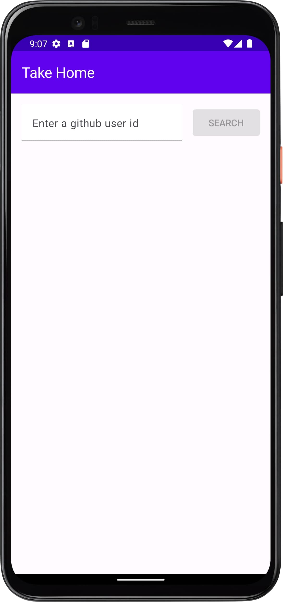
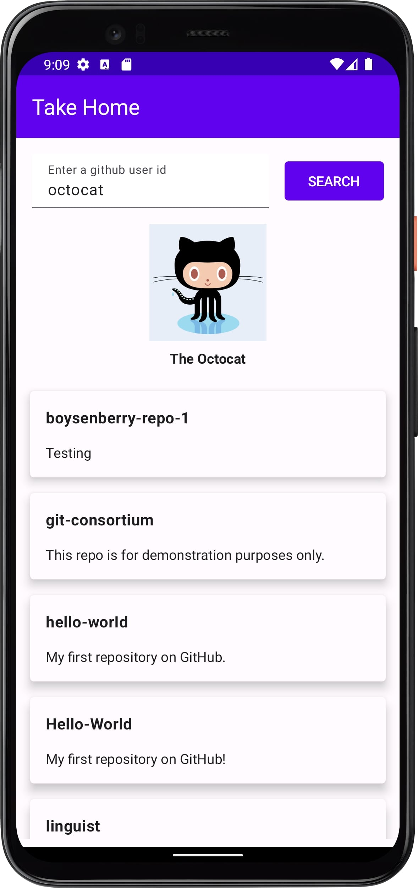
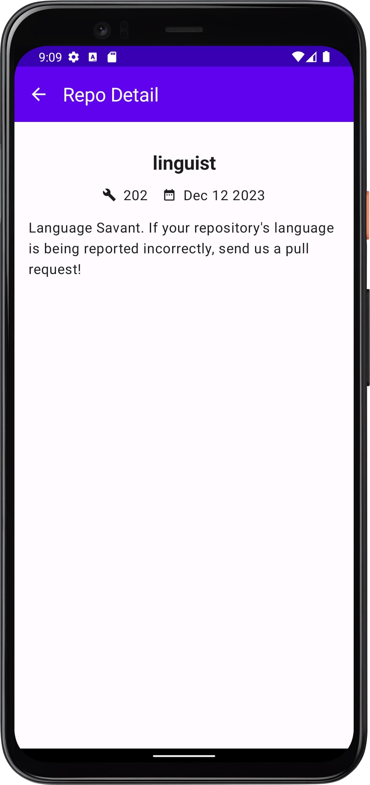

# GitHubApiSample with Clean Architecture & Compose

An Android app which communicates with the public Github API in order to display information about a specific user.

## Screenshots

| Mode  | Home                                               | Home - With User                                             | Repo Details                                              |
|-------|----------------------------------------------------|--------------------------------------------------------------|-----------------------------------------------------------|
| Light |  |  |  |

## Features

- The app should accept a github user's id as input and display the specified user's avatar and
  name.
- For each public repository owned by the user, the name and description are shown in a scrollable
  list.
- When a repository is selected, user should go to a detail screen which should display the details
  regarding that
  specific repo.
    - Display the total number of forks across all the user's repos on detail screen. If the total
      number of forks exceed count 5000 then we want to have a star badge

### Other Features

- Network monitor: The app will let user know if it has working internet.
- Pagination: Efficiently loads large amounts of data to improve the user experience.

# Architecture Patterns

### 1. Clean Architecture

Clean architecture is a software design pattern that helps to improve the maintainability,
testability, and scalability of Android apps.
It is based on the idea of separating the different concerns of an app into different layers, such
as the presentation layer, the business logic layer, and the data layer. This makes it easier to
make changes to the app without affecting other parts of the codebase.

These days lot of hybrid approach for an app development is coming like KMM, Flutter having clean
architecture in place
let us migrate from one framework to other easily and also simultaneously develop in multiple
frameworks.

### 2. MVVM

The Model-View-ViewModel (MVVM) pattern is a design pattern that separates the user interface (View)
from the underlying data and business logic (Model). It introduces an intermediary component called
the ViewModel, which is responsible for handling the presentation logic and maintaining the state of
the UI.

Benefits of MVVM over MVP

|              | MVVM                                                                                                                             | MVP                                                                                                                                              |
|--------------|----------------------------------------------------------------------------------------------------------------------------------|--------------------------------------------------------------------------------------------------------------------------------------------------|
| Data Binding | MVVM often provide robust data binding mechanisms, allowing automatic synchronization of data between the ViewModel and the View | Data binding is not inherent in the pattern, and developers often need to write explicit code to update the UI when the underlying data changes. |
| Testability  | The ViewModel, responsible for presentation logic, can be tested independently of the UI                                         | the Presenter is closely tied to the View. Testing the Presenter often involves mocking or creating test doubles for the View interfaces,        |
| Lifecycle    | provide lifecycle awareness, simplifying the management of UI-related data and reducing the risk of memory leaks                 | it may require additional effort to manage the lifecycle effectively                                                                             |

### 3. Repository

The Repository Pattern is a design pattern commonly used in software development to abstract and
centralize data access logic. It provides a clean and organized way to manage the interaction
between the application's business logic and the data sources (such as databases, web services, or
APIs).

- Abstracts and centralizes data access logic, decoupling business logic from storage details.
- Separates data access, making code modular. Changes are confined to the repository, easing
  maintenance.
- Enhances testability by separating concerns. Mocking repositories in tests isolates business
  logic.
- Facilitates easy switching between data sources (e.g., local database to remote API).

### 4. Paging

For pagination, Paging3 library is used which has the following features:

- In-memory caching for your paged data. This helps ensure that your app uses system resources
  efficiently while working with paged data.
- Built-in request deduplication, which helps ensure that your app uses network bandwidth and system
  resources efficiently.
- Support for Kotlin coroutines and flows as well as LiveData and RxJava.
- Built-in support for error handling, including refresh and retry capabilities.

### 5. Feature First Folder Structure

It, is an architectural pattern in Android development where code related to a specific feature is
organized into its own module or package. Here are some benefits of using a feature-first folder
structure in Android:

- Modularity: Promotes modularity by organizing code related to a feature in a separate module or
  package.
- Code Isolation: Minimizes dependencies, isolating feature-specific code.
- Parallel Development: Facilitates concurrent development of different features.
- Clear Ownership: Assigns clear ownership and responsibilities for each feature.
- Independent Testing: Supports focused unit and UI testing of individual features.
- Dynamic Delivery: Enables on-demand delivery and updates of features independently.
- Readability and Maintainability: Improves code readability and maintainability by aligning with
  feature architecture.
- Ease of Onboarding: Simplifies onboarding of new developers with a clear feature structure.

# Testing

Test-Driven Development (TDD): It is a software development approach where tests are written before
the actual code is developed. The process follows a cycle: write a test, run the test (which
initially fails since the code isn't implemented yet), implement the code to pass the test, and then
refactor the code if needed.

This is used for data and domain layer

Feature-Driven Development (FDD): It is an iterative and incremental software development
methodology. It focuses on building features or functionality in short cycles, typically two weeks.
FDD is driven by client-valued features, and the development process is organized around these
features.

This is used for presentation layer

Testing an Android application typically involves a combination of different testing approaches to
ensure the reliability, functionality, and performance of the app.

| Testing Approach                     | Objective                                                                         | Tools                                   | Status      |
|--------------------------------------|-----------------------------------------------------------------------------------|-----------------------------------------|-------------|
| **Unit Testing**                     | Verify individual units (methods/functions) in isolation.                         | JUnit, Mockito, Robolectric             | Done        |
| **Integration Testing**              | Validate interaction between different components/modules.                        | AndroidJUnitRunner, Espresso            | Pending     |
| **Functional Testing**               | Ensure app features work as intended from the user's perspective.                 | Espresso, UI Automator                  | Pending     |
| **UI Testing**                       | Verify correctness of the app's user interface.                                   | Espresso, UI Automator                  | In progress |
| **End-to-End (E2E) Testing**         | Simulate real user scenarios and test the entire application flow.                | Appium, Detox                           | Pending     |
| **Performance Testing**              | Assess app performance, responsiveness, and resource usage.                       | Android Profiler, third-party tools     | Pending     |
| **Security Testing**                 | Identify and address vulnerabilities that could compromise security.              | Static analysis tools, dynamic tools    | Pending     |
| **Accessibility Testing**            | Ensure app accessibility for users with disabilities.                             | Android Accessibility Scanner, TalkBack | Pending     |
| **Device and Configuration Testing** | Validate app behavior on different devices and configurations.                    | Firebase Test Lab, device emulators     | Pending     |
| **Robustness Testing**               | Assess app's ability to handle unexpected inputs, errors, and adverse conditions. | -                                       | Pending     |

## Built With

- [Kotlin](https://kotlinlang.org/) - First class and official programming language for Android
  development.
- [Coroutines](https://kotlinlang.org/docs/reference/coroutines-overview.html) - For concurrency and
  asynchronous tasks
- [Flow](https://kotlin.github.io/kotlinx.coroutines/kotlinx-coroutines-core/kotlinx.coroutines.flow/-flow/) -
  A asynchronous data stream that sequentially emits values and completes normally or with an
  exception.
- [StateFlow](https://developer.android.com/kotlin/flow/stateflow-and-sharedflow) - A live data
  replacement.
- [Android Architecture Components](https://developer.android.com/topic/libraries/architecture) -
    - [Jetpack Compose](https://developer.android.com/jetpack/compose) - Modern toolkit for building
      native UI
    - [Material 3](https://m3.material.io/) - Modern design guide native UI theme.
    - [Paging3](https://kotlinlang.org/) - Load and display small chunks of data at a time.
    - [ViewModel](https://developer.android.com/topic/libraries/architecture/viewmodel) - Stores
      UI-related data that isn't destroyed on UI changes.
    - [SavedStateHandle](https://developer.android.com/reference/androidx/lifecycle/SavedStateHandle) -
      A handle to saved state passed down to androidx.lifecycle.ViewModel.
    - [Navigation Components](https://developer.android.com/guide/navigation/navigation-getting-started) -
      Navigate fragments more easily.
- [Dependency Injection](https://developer.android.com/training/dependency-injection)
    - [Hilt](https://dagger.dev/hilt) - An easier way to incorporate Dagger DI into the Android
      application.
- [Retrofit](https://square.github.io/retrofit/) - A type-safe HTTP client for Android and Java.
- [Mockito](https://github.com/mockito/mockito) - For Mocking and Unit Testing

## Installation Instruction

For development, the latest version of Android Studio is required. The latest version can be
downloaded from [here](https://developer.android.com/studio/).

- Start Android Studio
- Run Application

### Code Formatting

We use ktfmt in conjunction with Spotless to maintain consistent and well-formatted Kotlin code
throughout our project. Follow these instructions to set up and use ktfmt with Spotless:

Formatting Code
To format your Kotlin code using Spotless, run the following Gradle task:

```bash
./gradlew spotlessApply
```

## Todo

- [ ] Performance
    - [ ] Baseline Profile
    - [ ] Enable compose compiler matrix
    - [ ] Leak Canary
- [ ] Code Quality
    - [ ] Increase test coverage
    - [ ] Implement Git Hooks
    - [ ] Fix Lint Error
  - [x] Complete Documentation
  - [x] Implement code formatter

## Additional Resources

- [Android App Architecture](https://developer.android.com/topic/architecture)
- [Clean Architecture Uncle Bob](https://blog.cleancoder.com/uncle-bob/2012/08/13/the-clean-architecture.html)
